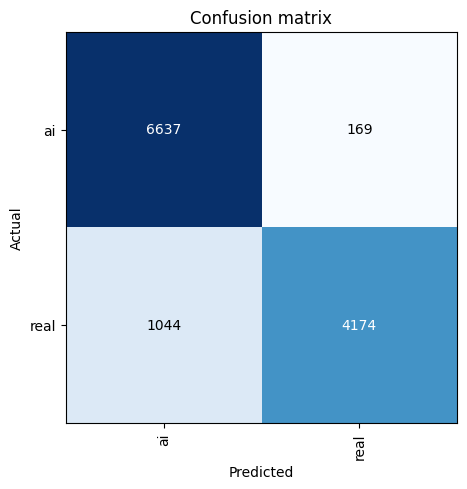

# Assigment 3

## Task 1 - Paddy Disease Detection

As stated in the assignment, we will create a model to detect paddy diseases using the dataset provided. I started by looking and implementing the code that Jeremy Howard provided, and managed to get similar results to the ones he got, although the provided compute is not suitable for his models and resulted in a very long training time. I therefore started to play with the model and tried to improve the results while keeping the training time at tolerable level.

I initially did a test run of what Jeremy Howard had done, just to see if I could replicate his results. After several hours of training on a Google Colab notebook, which offers 16 GB of VRAM compared to our 8 GB at the computer lab, I got a similar result, but was left with no more compute tokens. I therefore realised that in order to continue working on this task with limited compute I had to make some changes.

The first thing I did was to try different architectures. I started with the Resnet50 architecture, which is a very popular, but now an old architecture for image classification tasks, and to reduce the training time, I used a smaller input size of 224x224. The results were not very good, with a validation accuracy of around 0.8. I then tried the Resnet101 architecture, which is a deeper version of Resnet50, and the results improved slightly, with a validation accuracy of around 0.86. I could have tried to improve these resnet models more, with more augmentations and fine-tuning the hyperparameters, but I knew that Mr. Howard has used different architectures, such as ConvNext and ViT.

I therefore tried the ConvNext Small 22k and found that it performed much better than a Resnet101 and similar architectures. This is likely due to the fact that ConvNext is a modernized convolutional neural network inspired by the transformer era (like ViT), while it keeps the efficiency of CNNs and that the Convnext model is pretrained on ImageNet-22K (22,000 classes), and Resnet is usually pretrained on ImageNet-1K (1,000 classes). The ConvNext has a tendency to build stronger hierarchical features due to its modern block structure and larger receptive fields, and since the disease is not very visible, the model needs to learn more complex features.

To try to make the model even better I created an ensemble of Resnet models and ConvNext models with different hyperparameters and augmentations. The results were very good, with a score of around 0.97846 on Kaggle, while still keeping the training time to a reasonable level (34 min, 8 GB GPU memory). The first ensemble looked like this:

| Arch                  | Image size | Epochs | Error rate | Training time (approx) |
| --------------------- | ---------- | ------ | ---------- | ---------------------- |
| resnet50              | 224        | 10     | 0.144      | 7 min                  |
| resnet101             | 224        | 10     | 0.142      | 10 min                 |
| convnext_small_in22k  | 224        | 10     | 0.028      | 11 min                 |
| vit_small_patch16_224 | 224        | 10     | 0.026      | 6 min                  |

The ensemble works similarly to Jeremy's model, where the predictions of each model are averaged to get the final prediction.

After realizing that the resnets were not performing as well as the ConvNext and ViT models, I decided to remove them from the ensemble and only keep the ConvNext and ViT models. The next ensemble turned out like this:

| Arch                  | Image size | Epochs | Error rate | Training time (approx) |
| --------------------- | ---------- | ------ | ---------- | ---------------------- |
| convnext_small_in22k  | 224        | 10     | 0.024      | 11 min                 |
| vit_small_patch16_224 | 224        | 10     | 0.029      | 6 min                  |

Which resulted in a score of 0.98306 on Kaggle, which is slightly better. An ensemble with only two models is not really enough when the descision is based on the average of the predictions though, so I added two more variants of the ConvNext model and the ViT model with different augmentations and hyperparameters. The improved ensemble looked like this:

| Arch                  | Image size | Epochs | Error rate | Training time (approx) |
| --------------------- | ---------- | ------ | ---------- | ---------------------- |
| convnext_small_in22k  | 299        | 10     | 0.024      | 16 min                 |
| convnext_small_in22k  | 224        | 10     | 0.024      | 11 min                 |
| vit_small_patch16_224 | 224        | 10     | 0.029      | 6 min                  |

This resulted in a score of 0.98385 on Kaggle. The training time was around 30 minutes, and the GPU memory usage was around 8 GB.

As a final test, I added a nother ConvNext model with a different input size of 320. Which resulted in a slightly higher score (0.98539) on Kaggle, but with the downside of a substantially longer training time of around 1 hour and 34 minutes. The final ensemble looked like this:

| Arch                  | Image size | Epochs | Error rate | Training time (approx) |
| --------------------- | ---------- | ------ | ---------- | ---------------------- |
| convnext_small_in22k  | 320        | 10     | 0.021      | 60 min                 |
| convnext_small_in22k  | 299        | 10     | 0.024      | 16 min                 |
| convnext_small_in22k  | 224        | 10     | 0.025      | 11 min                 |
| vit_small_patch16_224 | 244        | 10     | 0.032      | 6 min                  |

I spent a lot of time trying out if I could improve the GPU/CPU usage by rescaling the whole dataset to the desired sizes before starting any training, without much success. The resize function and scale augmentations in Fast AI are not the bottle neck of the training. 

In terms of other augmentations, I used Fast AI's standard augmentations which is defined as follows:

| Augmentation                           | Value/Setting         |
|----------------------------------------|-----------------------|
| Random horizontal flips                | Yes                   |
| Maximum degree of rotation             | 10°                   |
| Minimum zoom                           | 1.0                   |
| Maximum zoom                           | 1.1                   |
| Maximum scale for changing brightness  | 0.2                   |
| Maximum value for changing warp        | 0.2                   |
| Probability of affine transformation   | 0.2                   |
| Probability of brightness/contrast     | 0.75                  |
| Padding mode                           | Reflection            |

## Task 2 - Deepfake Detection

In this task, we will create a model to detect deepfake images using a dataset of real and fake images. Similar to the paddy disease detection task, we will leverage transfer learning and fine-tune a pre-trained model for this purpose.

### Initial Experiments: ResNet50 Baseline
I began by analyzing the dataset and applied similar preprocessing techniques as used in the paddy project. For our baseline, I selected the ResNet50 architecture due to its proven performance and fast training capabilities, especially in early prototyping. By keeping the number of training epochs low, I could quickly iterate over various configurations of image size, augmentations, and learning rates.

To determine the optimal input resolution, I conducted experiments with image sizes of 512×512, 256×256, and 128×128. Surprisingly, I observed that smaller image sizes often yielded better performance, likely due to the model’s improved ability to generalize. However, reducing the resolution too much caused the model to miss subtle artifacts and imperfections characteristic of deepfakes. Ultimately, the 256×256 resolution struck a balance between detail and generalization, producing the best results for ResNet50. This model achieved a Kaggle score of approximately 0.895, which served as a strong baseline.

| epoch | train_loss | valid_loss | error_rate | time  |
|-------|------------|------------|------------|-------|
| 0     | 0.193611   | 0.365707   | 0.112774   | 03:11 |
| 1     | 0.155723   | 0.326862   | 0.102295   | 03:11 |
| 2     | 0.125915   | 0.298038   | 0.095060   | 03:14 |
| 3     | 0.133721   | 0.297405   | 0.100882   | 03:19 |

### Testing Alternative Architectures
I then explored other architectures such as ConvNeXt Small and Vision Transformers (ViT), hypothesizing that their ability to model local textures could offer an advantage in detecting subtle deepfake imperfections. Multiple configurations were tested, including different patch sizes and training schedules.

Although the ConvNeXt Small model performed comparably well, reaching a score of 0.889, it required significantly more computational resources and longer training time without offering a meaningful improvement. Similarly, ViT models showed promise but consistently fell short of outperforming ResNet50. These results suggest that for this particular task, ResNet50 strikes a favorable tradeoff between accuracy, training speed, and generalization.

### Ensemble Strategy
As in the paddy disease detection task, I attempted to ensemble multiple models with ResNet50, ConvNeXt Small, and ViT variants—to combine their strengths. Ensembling is generally expected to reduce variance and leverage complementary decision boundaries, leading to improved performance.

However, in this case, the ensemble approach did not lead to an improvement over the best single ResNet50 model. The averaged predictions showed minor fluctuations in accuracy and even underperformed slightly compared to the standalone ResNet50. Several factors may explain this; Firstly, rhe individual models may have learned similar decision boundaries, reducing the benefit of ensembling. Secondly, averaging softmax probabilities across models with different confidence levels might have introduced noise. And lastly, models like ViT and ConvNeXt, though powerful, might fail to pick up on the exact set of features critical for this task, weakening the ensemble’s consensus.

### Other methods from the literature

After researching the topic, I found a paper called "Fighting deepfake by exposing the convolutional traces on images" (Guarnera et al., 2020) that suggested using a technique were you calculate convolution traces of the images, by using a algorithm called Expectation Maximization (EM). The method works by calculating the convolution traces of the images, which are the tiny patterns, imperfections and artifacts left behind by the GANs (Generative Adversarial Networks) that create deepfakes. These traces are often too subtle for the human eye to detect, but they can be captured by the EM algorithm. The EM algorithm iteratively refines the estimates of the convolution traces until they converge to a stable solution. Once the traces are calculated, they can be used as features for a classifier, such as Random Forest, to distinguish between real and fake images. A simple implementation of this algorithm was tested, and by using the Random Forest classifier, as recommended in the paper, I managed to get a accuracy of around 0.6, which is not particularly good. I therefore tried to use Support Vector Classification (SVC) as an alternative to Random Forest classifier. This increased the accuracy to 0.7, and shows that the method works, as the computed convolution traces have some signal, but they are noisy and hard to classify. In the paper, they get an even higher accuracy at around 0.9 and above, which tells me that my implementation of the paper might not be as good as theirs, and without GPU acceleration of the convolution trace computation it takes many hours to finish the dataset. 

Looking at this solution it is quite nice to see that the task is solvable without needing a black box, which these CNNs and RNNs are, and it is possible to explain how the model made its prediction on a understandable level. Making an understandable model will be important to be able to gain trust in the model and will supersede any deep learning model with equal accuracy.

Another paper titled "Deepfake Detection and Classification of Images from Video: A Review of Features, Techniques, and Challenges" (Bale, et al. 2024), gives a structured review of how deepfake images, especially those extracted from video, are detected and classified and it outlines three main approaches.

Feature-based methods rely on spotting visual inconsistencies like unnatural lighting, irregular eye reflections, or distorted facial expressions. Traditional machine learning models use predefined features to train classifiers, but they often struggle to adapt to new types of deepfakes. Deep learning techniques, and especially convolutional neural networks (CNNs) are more robust, as they can learn complex features and adapt to small manipulations.

The paper points out several ongoing challenges in the field, such as the rapid evolution of deepfake creation tools, the limited availability of diverse and representative datasets, and the difficulty of building models that perform well across different scenarios. To address these, the authors propose a framework for comparing detection techniques and stress the importance of real-world applicability, model robustness, and future research aimed at staying ahead of increasingly realistic forgeries.

Guarnera, L., Giudice, O., & Battiato, S. (2020). Fighting deepfake by exposing the convolutional traces on images. IEEE access, 8, 165085-165098.

Bale, D. L. T., Ochei, L. C., & Ugwu, C. (2024). Deepfake Detection and Classification of Images from Video: A Review of Features, Techniques, and Challenges. International Journal of Intelligent Information Systems, 13(2), 17–27. https://doi.org/10.11648/j.ijiis.20241302.11